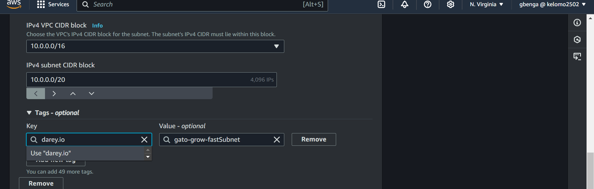
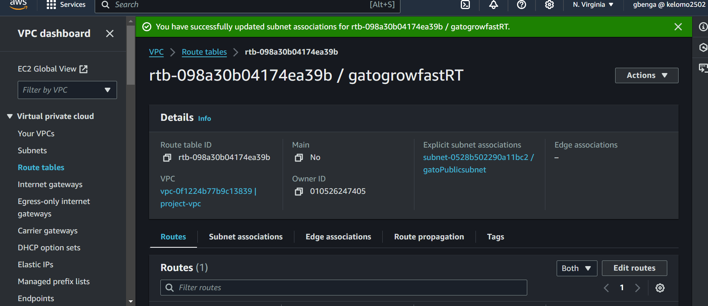

# Mastering-AWS-VPC

This focuses on AWS vpc infrastructure, including subnets, gateways and routing tables

## Implementation for GatoGrowFast.com

## Setting up a VPC

Sign into AWS account

- Navigate to the search bar and search for VPC
  

- Navigate to create VPC tab and click on it
  

- Select VPC only option, specify the ipv4 CIDR block and Create VPC

## Creating Subnets

- Locate the subnet tab and click on create subnet
  

- Choose the id the vpc you created previously, enter the subnet name, specify ipv4 CIDR for the subnet

- Creating the subnet
  To create the subnet, first click on the add new subnet button

-Sucessgully creating subnets
Two subnets have been created successfully. If you have CIDR overlaps, try resolve them by choosing a different range from the previous subnet created

## Creating Internet Gateway

- Navigate to the internet gateway options on the left side bar

- Click on create internet gateway

- Fill in the igw configuration and click create igw

- Attach the IGW to your vPC
  Click on the action tab, and click and attach to your vpc

## Enabling internet connectivity by setting up route tables

- Proceed to route tables option tab in th aws console

- Click on create route table

- Link the route table to vpc created

- After selecting VPC associated with intended RT, click on create route table

- Click on subnet association

- Choose the public subnet and click save

- navigate to routes and click edit routes

- Click on add route

- Set destination to 0.0.0.0/0 then select internet gateway.
  the route table has now been configured to route traffic to the internet gateway. Since its only the public subnet that is associated with this route table, only resoures within this subnet can access the internet

## Enabling outbound internet access via NAT gateway

- Navigate to the NAT Gateway section and find Create NAT gateway

- Click on create Nat gateway

- Give the Nategwy a name/tag

- Choose the subnet .i.e the private subnet

- Choose the connectivity type as private

- Click on create NAT Gateway

- NAT gwy successfully created

- Select the NATgwy
- Navigate to details tab
- From there, locate the subnet on the nat gwy and click on it

- navigate to the route table

- Click on the routable ID
- Click on Edit route tab

- Click on add route
- Set destination as 0.0.0.0/0 and target field as NAT gateway and then Choose the nat gwy you created

- Click save changes
- On the subnet assossiation section, select edit subnet association

- Choosw the private subnet and click save assosiation

## VPC PEERING

- Create two other VPC in thesame region
- Navigate to peering connection on the sidebar
- Click it and you will be directed to VPC peering page

- Click on create peering connection
- Provide a name for the VPC peering connection
- Select the requesterVPC
- Ensure to choose thesame region in this case since they were both created in thesame region
- Next select the accepterVPC
- Then click create peering connection
- In the peering connection, locate action option on the right side where you you can either accept or reject the connection request

- Click on accept request
- Click on the main rout table ID of the accepter VPC
- Choose the route table and click and click the route tab
- Then click on edit routes button
- Click add route
- Go to VPC page and locate the requester VPC
- Copy the requesterVPC CIDR and paste in the destination field when adding a route and choose the target as peering connection
- Click save changes
- Copy CIDR of the accepterVPC
- Now click on the main route table ID of the requesterVPC
- Paste the CIDR in the destination field and peering connection for the target
- Then choose the peering connection you created
- The connection has been successfully established
