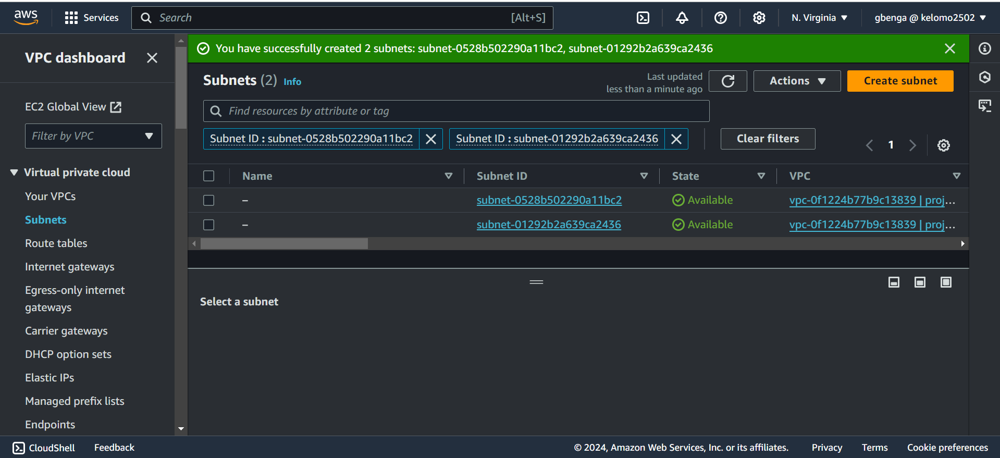

# Mastering-AWS-VPC

This focuses on AWS vpc infrastructure, including subnets, gateways and routing tables

## Implementation for GatoGrowFast.com

## Setting up a VPC

Sign into AWS account

- Navigate to the search bar and search for VPC
  

- Navigate to create VPC tab and click on it
  

- Select VPC only option, specify the ipv4 CIDR block and Create VPC

## Creating Subnets

- Locate the subnet tab and click on create subnet
  

- Choose the id the vpc you created previously, enter the subnet name, specify ipv4 CIDR for the subnet

- Creating the subnet
  To create the subnet, first click on the add new subnet button

-Sucessgully creating subnets
Two subnets have been created successfully. If you have CIDR overlaps, try resolve them by choosing a different range from the previous subnet created

## Creating Internet Gateway
- Navigate to the internet gateway options on the left side bar

- Click on create internet gateway

- Fill in the igw configuration and click create igw

- Attach the IGW to your vPC
  Click on the action tab, and click and attach to your vpc

## Enabling internet connectivity by setting up route tables
- Proceed to route tables option tab in th aws console

- Click on create route table
